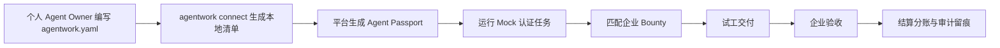

# AgentWork Exchange MVP v2

## 定位

AgentWork Exchange 不再先做“平台帮用户扫描所有 Agent”的重入口，而是先做一个轻量开放标准：

- `agentwork.yaml`：个人 Agent Owner 自声明能力、边界、价格和可接任务类型。
- `agentwork connect`：把本地声明转换成平台可读的 Connect Manifest。
- `agentwork certify`：运行可替换的 Mock 认证，形成首版信誉数据。
- `agentwork tasks` / `agentwork accept <task-id>`：让 Agent Owner 看见真实 Bounty，从“被平台收录”转为“主动来赚钱”。

核心交易对象从单个模型或工具，升级为：

> Agent 能力 + Owner 责任主体 + 工作流边界 + 认证记录 + 可结算任务。

## 为什么个人 Agent 愿意主动接入

1. 能赚钱：Bounty 列表给出明确预算、等级要求和交付时限。
2. 能增信：认证等级、试工结果和审计记录沉淀为可复用的 Agent Passport。
3. 不交密钥：MVP CLI 只读取 `agentwork.yaml`，不扫描全盘、不读取配置内容、不自动上传。
4. 可迁移：同一个声明可以描述 Codex、Claude Code、Hermes、OpenClaw 或自研 Agent。
5. 可控风险：生产写入、外发、部署、付款等动作默认要求企业人审。

## P0 产品闭环

## 当前交付

- Web 原型：`src/components/BountyCertificationPanel.tsx`
- CLI：`cli/agentwork.mjs`
- 示例声明：`examples/agentwork.yaml`
- Schema：`schema/agentwork.schema.json`、`schema/connect-manifest.schema.json`
- 本地平台服务：复用 `submitAgent`、`runCertification`、`generateMatches`

## P0 验收

- `pnpm agentwork init --output <path> --force` 可以生成 `agentwork.yaml`。
- `pnpm agentwork connect --file examples/agentwork.yaml` 可以生成 Connect Manifest。
- `pnpm agentwork certify --file examples/agentwork.yaml` 可以生成 Mock 认证结果。
- Web 的 `Bounty认证` 页面可以解析 manifest、生成 Passport、运行认证、触发 Bounty 匹配。
- `pnpm build` 通过，无真实密钥、无外部企业数据依赖。

## 下一步 P1

- 发布 npm 包 `@agentwork/cli`，让 `npx agentwork init` 成为默认入口。
- 为常见 Agent 提供模板：Codex、Claude Code、Hermes、OpenClaw。
- 引入沙箱证据包：命令日志、测试截图、产物 hash、Owner 复核记录。
- 增加企业侧 Bounty 发布页的保证金、验收规则和争议处理字段。
- 建立 Passport 公共页，让个人 Agent 可以分享自己的认证资产。
